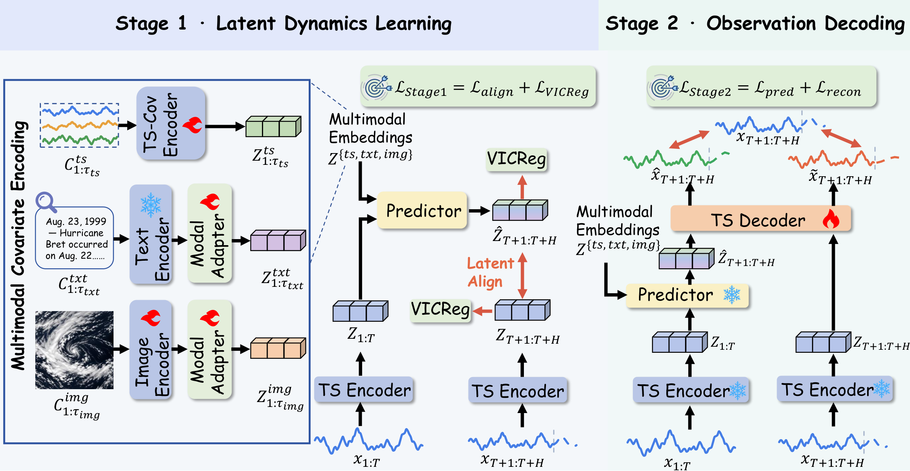
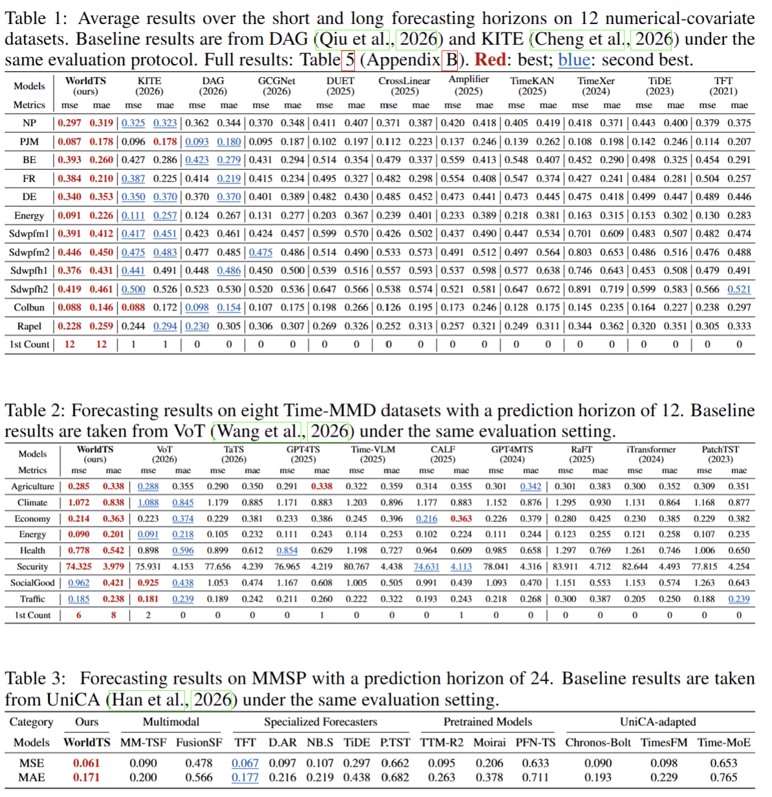

# WorldTS

This repository provides the PyTorch implementation of WorldTS.

## Introduction

WorldTS learns latent-state dynamics for time series forecasting with numerical,
textual, and image covariates. It predicts future latent states and decodes them
into forecasts through a two-stage training framework.

<div align="center">
  <a href="figures/overview.pdf"></a>
</div>

## Quickstart

### 1. Requirements

Use separate environments for the three benchmarks. Run the following commands
from the repository root:

```bash
# Numerical covariates
conda create -n worldts-dag python=3.8.20
conda run -n worldts-dag python -m pip install -r DAG-bench/requirements.txt

# Textual covariates
conda create -n worldts-vot python=3.10.20
conda run -n worldts-vot python -m pip install -r TimeMMD-bench/requirements.txt

# Image covariates
conda create -n worldts-unica python=3.10.20
conda run -n worldts-unica python -m pip install -r MMSP-bench/requirements.txt
```

### 2. Data preparation

Download the prepared datasets from the following sources and place them in the
corresponding directories:

| Benchmark | Data | Location |
| --- | --- | --- |
| DAG-bench | [Google Drive](https://drive.google.com/file/d/1K2AvogpOpSz1PiQ53dPchzGv_PqlCWAK/view) | `DAG-bench/dataset/forecasting/` |
| TimeMMD-bench | [Prepared CSV files](https://github.com/decisionintelligence/VoT/tree/main/data) | `TimeMMD-bench/data/` |
| MMSP-bench | [Google Drive](https://drive.google.com/file/d/166YnyeFcVYKXNL8MyU2cp6jd9cAnSaIH/view) | `MMSP-bench/unica_datasets/mmsp/` |

For TimeMMD-bench, download the [GPT-2 model and tokenizer](https://huggingface.co/openai-community/gpt2) to
`TimeMMD-bench/language_model/openai-community/gpt2/`.

### 3. Train and evaluate

WorldTS implementations: [Numerical](DAG-bench/ts_benchmark/baselines/worldts/models/worldts_model.py) · [Textual](TimeMMD-bench/models/worldts/models/worldts_model.py) · [Image](MMSP-bench/models/worldts/models/worldts_model.py).

Run the commands below from the repository root in the corresponding environment.

```bash
# Numerical covariates: 12 datasets
conda activate worldts-dag
GPU=0 bash DAG-bench/scripts/w_future/worldts.sh

# Textual covariates: 8 datasets
conda activate worldts-vot
GPU=0 bash TimeMMD-bench/scripts/worldts.sh

# Image covariates: MMSP
conda activate worldts-unica
GPU=0 bash MMSP-bench/scripts/worldts.sh
```

## Results

Forecasting results with numerical, textual, and image covariates are shown below.

<div align="center">
  
</div>

## Acknowledgements

We thank the authors of [DAG](https://github.com/decisionintelligence/DAG),
[VoT](https://github.com/decisionintelligence/VoT), and [UniCA](MMSP-bench/README.MD)
for sharing their code and datasets.
